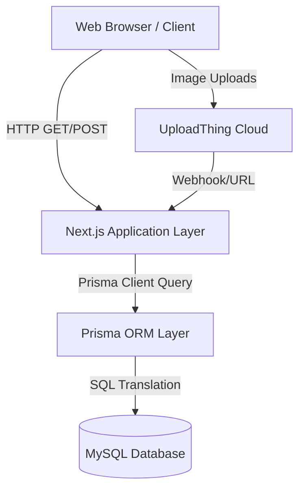

# Technical & Architecture Guide
**Project Name:** ConnectForum
**Version:** 1.0

---

## 1. System Architecture Overview
ConnectForum utilizes a modern, serverless-ready architecture centered around **Next.js**. It follows a Monolithic structure where the Frontend (React/Client Components) and Backend (Next.js API Routes/Server Actions) live in the same repository, sharing TypeScript interfaces and business logic.

---

## 2. Deep Dive: Technology Stack Rationale

- **Next.js (v15):** Chosen for its hybrid rendering. Public forum pages can be Server-Side Rendered (SSR) for SEO benefits, while interactive dashboards (like DMs) use Client-Side Rendering (CSR).
- **TypeScript:** Enforces strict typing. For example, Prisma generates types based on the schema, meaning if a database column changes, the frontend code will immediately throw compilation errors if not updated.
- **Prisma ORM (v6):** Replaces raw SQL with a type-safe API. It handles migrations automatically (`npx prisma migrate dev`), making schema evolutions frictionless.
- **Redux Toolkit & React-Redux:** Used for complex global state management (e.g., maintaining the current user's session state, caching notifications, managing active chat windows) without prop-drilling through Material UI components.
- **TipTap:** A headless wrapper around ProseMirror. Chosen over traditional WYSIWYG editors because it outputs clean JSON or sanitized HTML, preventing Cross-Site Scripting (XSS) vulnerabilities.

---

## 3. Directory Structure & Execution Flow

### Significant Directories (c:/gpu/community)
- `/src/app/` or `/src/pages/`: Contains the Next.js routing logic. Each folder represents a URL route (e.g., `/forums/create`).
- `/src/components/`: Reusable Material UI React components (e.g., `ForumCard.tsx`, `Navbar.tsx`).
- `/src/api/`: Backend endpoints that interface with Prisma.
- `/prisma/schema.prisma`: The single source of truth for the database layout.
- `/playwright-report/` & `/tests/`: Automated testing environments. Playwright ensures the UI works across browsers, while Jest tests isolated functions.

### Execution Flow Example: Loading a Forum Post
1. User navigates to `/forums/123`.
2. **Server-Side:** Next.js intercepts the request. The server calls `prisma.forum.findUnique({ where: { id: '123' }, include: { user: true, comments: true } })`.
3. **Database:** Prisma executes a SQL `JOIN` to fetch the forum, the author's details, and the comments.
4. **Rendering:** Next.js compiles the HTML with this data already embedded and sends it to the browser.
5. **Hydration:** The browser loads the HTML instantly, then React "hydrates" the page, enabling interactive features like the "Like" button and Redux state.

---

## 4. Database Schema Deep Dive (MySQL)

The database relies heavily on relational constraints to maintain data integrity.

### Key Optimization & Integrity Features:
- **Cascading Deletes:** Notice `@relation(..., onDelete: Cascade)` in `schema.prisma`. If a `User` is deleted, all their `Forums`, `Comments`, `Likes`, and `Messages` are automatically wiped by the database engine, preventing orphaned data.
- **Composite Unique Keys:** 
  - `@@unique([userId, forumId])` on `Bookmark` and `ForumLike`. This enforces at the database level that a user can only like or bookmark a specific post exactly *once*. No frontend bug can bypass this.
  - `@@id([followerId, followingId])` on `Follow`. Forms a strict many-to-many relationship preventing duplicate follows.

### The Gamification Schema:
The `User` table holds `level` (Int, default 1), `xp` (Int, default 0), and `badges` (Text). 
- When `xp` updates, backend logic evaluates if `xp >= threshold`. If true, `level` increments.
- `badges` is stored as a comma-separated string (e.g., `"founder,top_poster,bug_hunter"`). This is a highly efficient way to store multiple text flags without requiring an entirely separate table and complex join operations.

---

## 5. Security Posture
- **Authentication:** Sessions are managed by NextAuth. Even if a JWT is stolen, changing the `NEXTAUTH_SECRET` invalidates all active sessions platform-wide.
- **Data Injection:** Prisma uses parameterized queries natively. SQL Injection is virtually impossible unless raw SQL (`prisma.$queryRaw`) is explicitly and improperly used.
- **XSS Prevention:** React natively escapes string variables. TipTap sanitizes HTML output before rendering it dangerously inside `html-react-parser`.
